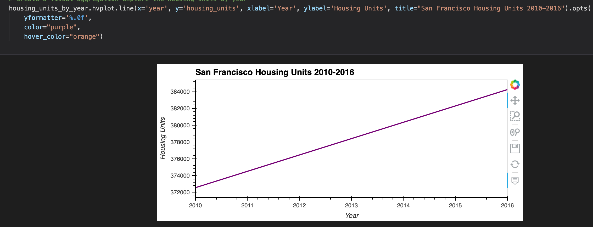
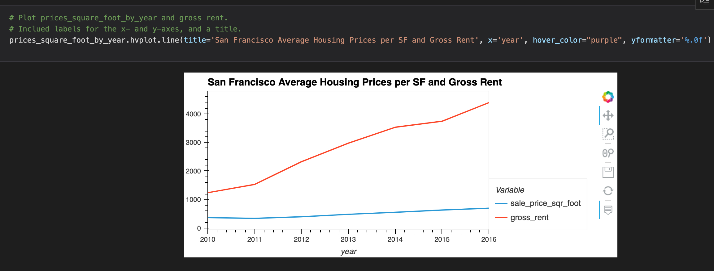
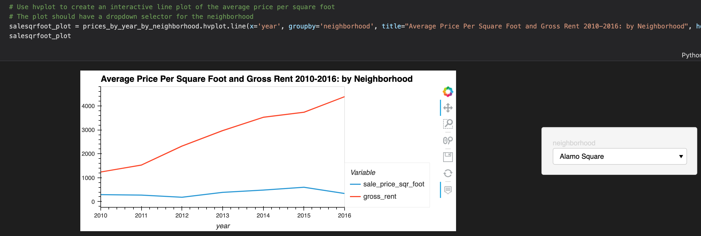
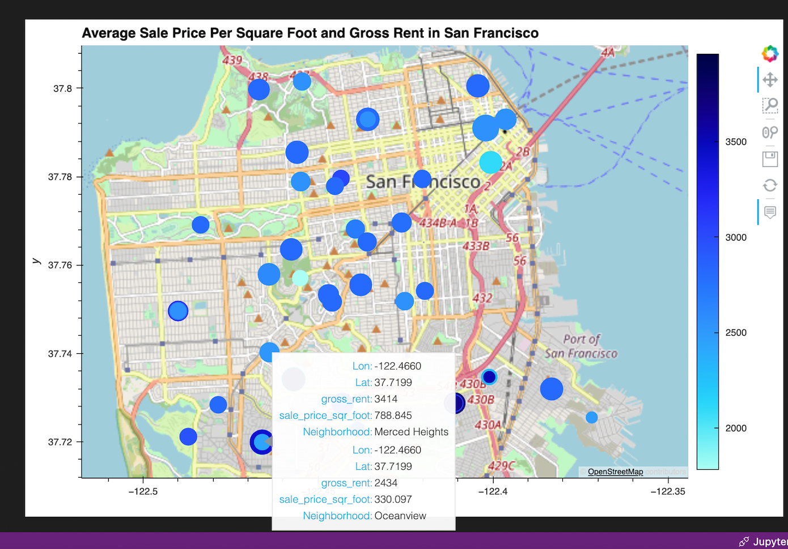

# Investing in San Francisco- Challenge 6 Submission
This challenge investigates whether or not there are real estate investment opportunities in San Francisco, and if so, which neighborhood. The data analyzed consists of historical price per square foot, housing units, and gross rents from 2010-2016. A dataframe with the aforementioned data points is then overlayed with neighborhood coordinates to produce an interactive map that shows the user average gross rent and price per square foot by neighborhood.
--

## Technologies

This challenge uses the hvplot library to generate interactive graphs.

--

## Installation Guide

The hvplot function must be installed and imported to generate the interactive line graphs and geo plot.

--

## Usage

A key bit of code used to plot one hvplot plot in particular is the groupby function. Grouping the years and neigborhoods with corresponding sales price and gross rent data points created a meaninful interactive line graph with a drop down menu to select the neighborhood.

Plotting with hvplot provides far more capabilities and options than the normal plot function. In addition to the information shown on the graphs, further corresponding data from the graphs can be seen by hovering over the lines plotted - this was done with the hvplot hover_cols function.

The geoplot, the last plot, uses two concatenated dataframes to overlay the historical pricing data over specific neighborhood coordinates.

Here are the snapshots of the graphs generated for this challenge:

--

## Contributors
Angela Richter is the sole contributor to all files in this repository.

--

## Licenses

This program and related items in this repository is intended for learning purposes only.